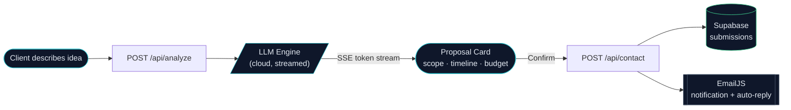

# 3D Portfolio Website

**AI-integrated fullstack freelancer.**  
*I build things that work in production, not just in demos.*

&nbsp;

---

## Introduction

Most portfolios tell you what a developer *can* do. This one shows it.

**Problem:** Clients describe a project idea in a single message. Developers take days to reply with a proper scope and budget. By then, the client has moved on.

**Solution:** The contact form here runs that estimation instantly. Describe your project — the AI reads it and streams back a scoped proposal (timeline, budget, tech stack) in real-time before you even hit send.

## Features

- **Interactive 3D Graphics**: Powered by Three.js and React Three Fiber for WebGL-rendered visuals
- **Smooth Animations**: Framer Motion for fluid transitions and scroll-driven interactions
- **Responsive Design**: Fully responsive layout using Tailwind CSS v4
- **3D Globe**: Interactive globe component using COBE
- **AI Proposal Flow**: Describes your project idea → AI scopes it in real-time via streaming → confirm and send. Faster than any back-and-forth email thread
- **Contact Form**: EmailJS-powered with dual templates — lead notification + client auto-reply, both include the full AI-generated proposal
- **Persistent Submissions**: Every inquiry logged to Supabase with full proposal JSON — nothing lost, queryable anytime
- **Project Showcase**: Dynamic project gallery with detailed modal views
- **Experience Timeline**: Visual timeline of professional experiences
- **Testimonials Section**: Client and colleague testimonials

### AI Proposal Flow

> Rate limited. DNS MX validation on every email. No fake domains, no spam.

## Tech Stack

### Core Technologies

| Technology | Version | Role |
|-----------|---------|------|
|  | 19.1.1 | UI framework with concurrent rendering |
|  | 7.1.2 | Build tool, instant HMR |
|  | 0.179.1 | WebGL 3D rendering |

### 3D & Animation

| Technology | Role |
|-----------|------|
|  | React renderer for Three.js |
|  | Helpers and abstractions for R3F |
|  | Scroll-driven animations and transitions |
|  | 5kb WebGL globe |

### Styling & UI

| Technology | Role |
|-----------|------|
|  | CSS-first utility framework |
|  | Class conflict resolution |

### Backend & Infrastructure

| Technology | Role |
|-----------|------|
|  | ESM server, API layer |
|  | REST endpoints with rate limiting |
|  | PostgreSQL — persistent submission logs |
| Cloud LLM | Real-time AI via SSE streaming |
|  | Dual-template email delivery |

## Key Components

- **Hero Section**: Eye-catching landing with 3D room scene and animated role switcher
- **About Section**: Interactive WebGL globe, tech orbit rings, and timezone display
- **Projects Section**: Portfolio projects with detailed modal views and live/repo links
- **Experiences Section**: Scroll-driven timeline with animated progress fill
- **Testimonials**: Client feedback carousel
- **Contact Form**: End-to-end AI proposal flow — from idea to scoped estimate to logged submission

---

**Available for freelance work.**  
Reach out through the [contact form](https://portfolio3d-xem2.onrender.com/#contact) — My solution will scope your project before I even reply.

